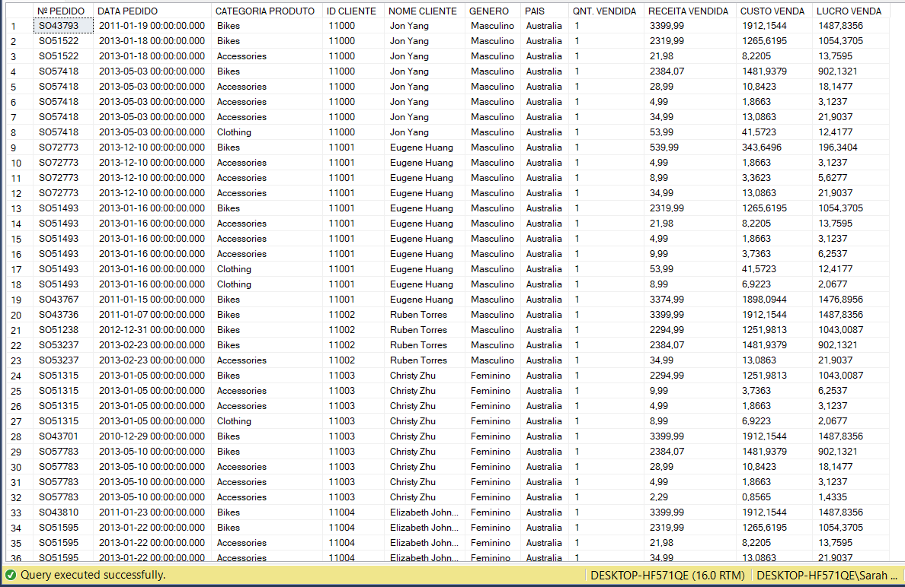
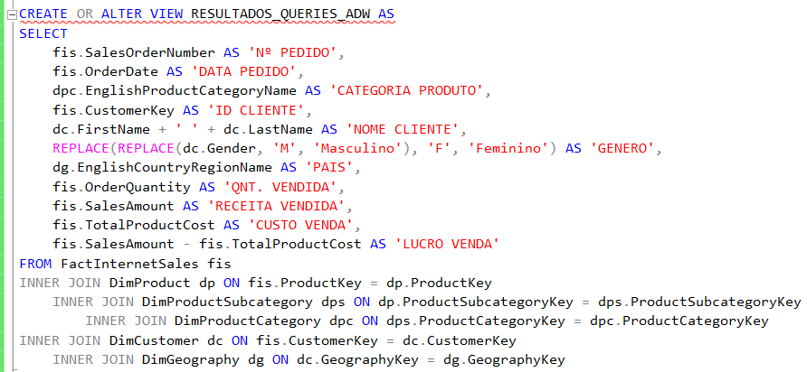
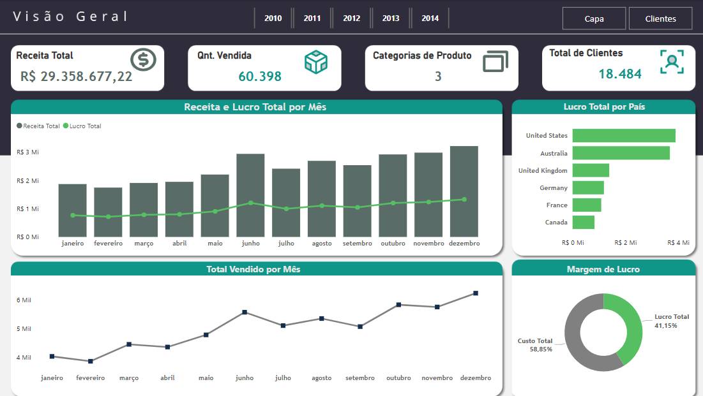
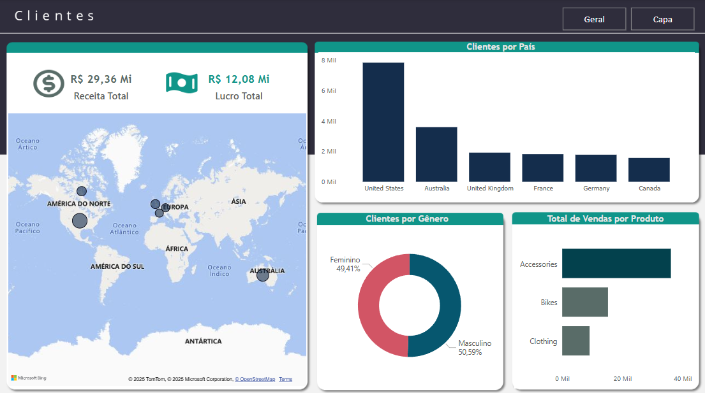

# Análise de Vendas com SQL + Power BI – Projeto de Dashboard Comercial

Este projeto representa meu primeiro case de integração prática entre **SQL Server e Power BI**, com foco em análise de dados comerciais. A proposta é transformar dados brutos em visualizações simples, interativas e compreensíveis, por meio da construção de KPIs, gráficos e análises visuais voltadas ao desempenho de vendas.

A base de dados foi tratada diretamente no SQL por meio de uma `VIEW`, e os resultados integrados ao Power BI com o objetivo final em gerar insights de negócio.

O painel foi dividido em dois blocos principais:

Pinel 1 – Visão Geral de Vendas: Apresenta 4 KPIs (Receita Total, Quantidade Vendida, Categoria de Produtos e Total de Clientes) e 4 gráficos, incluindo Receita e Lucro por mês, Quantidade Vendida por mês, Lucro por país e Margem de Lucro.

Painel 2 – Perfil dos Clientes: Traz 2 KPIs (Receita Total e Lucro Total) e gráficos com recortes sobre os clientes: Total Vendido por país, Clientes por país, Clientes por gênero e Vendas por categoria.


## Objetivos

- Trazer uma visão geral do desempenho de vendas da empresa, utilizando SQL para extrair, organizar e modelar os dados de forma estruturada.

- Apresentar as principais KPIs relevantes criadas para esse contexto do negócio.

- Transformar as informações extraídas em gráficos simples escolhidos de forma estratégica para facilitar a análise.

- Identificar padrões de receita e lucro ao longo do tempo, compreender a distribuição de clientes por país e gênero, além de analisar o impacto das categorias de produtos nas vendas.

- Já na parte visual, abordaremos um Storytelling simples mas que repassa insights claros para o leitor, facilitando a captação das informações e o entendimento geral do cenário analisado.


## Base de Dados Utilizada

A base utilizada foi a **AdventureWorks**, um banco de dados fictício desenvolvido pela Microsoft. Ela simula operações comerciais de uma empresa varejista, 
contendo informações sobre vendas, produtos, clientes, localização e dados financeiros.

O arquivo `.bak` utilizado está disponível na pasta [`/database`](./database), com o nome: `AdventureWorksDW2014.bak` 


## Ferramentas Utilizadas

- SQL (consultas e modelagens dos dados)
- Power BI (construção do dashboard e visualizações)
- Power Point (apoio na construção de layout do dashboard)

## Etapas do Projeto

### Definição de KPIs

- Identificação dos principais indicadores de desempenho a partir dos dados disponíveis. 

- Seleção de métricas relevantes para o negócio, como: Receita Total, Margem de Lucro, Quantidade Vendida, Total de Clientes, Lucro por País entre outros.

### Definição de Tabelas e Colunas

Antes de iniciar as análises, foi feita uma organização das tabelas e colunas para facilitar a criação das queries em SQL e garantir que os dados estivessem alinhados com os objetivos do dashboard.
A modelagem foi feita com base nas colunas mais relevantes para representar indicadores comerciais e o perfil dos clientes.


### Criação de View

Para centralizar as informações e facilitar o carregamento no Power BI, foi criada uma VIEW com as principais métricas e colunas necessárias para a análise.
Abaixo está o código completo da `VIEW` criada para consolidar os dados utilizados no projeto:

```sql
CREATE OR ALTER VIEW RESULTADOS_QUERIES_ADW AS
SELECT 
	fis.SalesOrderNumber AS 'Nº PEDIDO',
	fis.OrderDate AS 'DATA PEDIDO',
	dpc.EnglishProductCategoryName AS 'CATEGORIA PRODUTO',
	fis.CustomerKey AS 'ID CLIENTE',
	dc.FirstName + ' ' + dc.LastName AS 'NOME CLIENTE',
	REPLACE(REPLACE(dc.Gender, 'M', 'Masculino'), 'F', 'Feminino') AS 'GENERO',
	dg.EnglishCountryRegionName AS 'PAIS',
	fis.OrderQuantity AS 'QNT. VENDIDA',
	fis.SalesAmount AS 'RECEITA VENDIDA',
	fis.TotalProductCost AS 'CUSTO VENDA',
	fis.SalesAmount - fis.TotalProductCost AS 'LUCRO VENDA'
FROM FactInternetSales fis
INNER JOIN DimProduct dp ON fis.ProductKey = dp.ProductKey
	INNER JOIN DimProductSubcategory dps ON dp.ProductSubcategoryKey = dps.ProductSubcategoryKey
		INNER JOIN DimProductCategory dpc ON dps.ProductCategoryKey = dpc.ProductCategoryKey
INNER JOIN DimCustomer dc ON fis.CustomerKey = dc.CustomerKey
	INNER JOIN DimGeography dg ON dc.GeographyKey = dg.GeographyKey
```





- A estrutura da `VIEW`já oferece uma visão unificada das métricas de venda, permitindo cruzar dados como lucro, país, categoria e gênero de forma rápida e eficiente no Power BI.


### Conexão com o Power BI 

Os dados foram conectados ao Power BI diretamente pela view criada no SQL Server, facilitando a construção dos painéis e mantendo a estrutura já organizada para análise.


### Estrutura do Dashboard

O dashboard foi dividido em dois painéis principais:

#### Painel 1 – Visão Geral de Vendas

**KPIs:**
  - Receita Total
  - Quantidade Vendida
  - Número de Categorias de Produto
  - Total de Clientes 
 
**Gráficos:**
  - Receita e Lucro Total por Mês
  - Lucro Total por País
  - Total Vendido por Mês 
  - Margem de Lucro

#### Painel 2 – Perfil de Clientes

**KPIs:** 
  - Receita Total
  - Lucro Total
  
**Gráficos:**
  - Clientes por País
  - Clientes por Gênero
  - Total de Vendas por Categoria de Produto


### Visuais do Dashboard






#### Acesse o Dashboard Interativo

Você pode acessar a versão publicada do dashboard no Power BI clicando no link abaixo:

[Acesse]https://app.powerbi.com/view?r=eyJrIjoiMTkzNGU4MTEtNTg0Ni00ZDEyLWI1ZTEtY2EzYTQ3NjRkMjlhIiwidCI6IjY1OWNlMmI4LTA3MTQtNDE5OC04YzM4LWRjOWI2MGFhYmI1NyJ9


## Principais Insights gerados

- Os meses de **junho a dezembro** apresentaram maior receita, indicando uma tendência de alta no segundo semestre.
- **Estados Unidos e Austrália** foram os países com maior lucro total, sugerindo forte presença de mercado.
- A categoria **Accessories** teve o maior volume de vendas, destacando-se frente às demais.
- A proporção entre **clientes masculinos e femininos** está bem equilibrada, o que pode indicar uma comunicação de marca bem direcionada para ambos os públicos.
- O **lucro total corresponde a 41,15% da receita**, indicando uma margem saudável.


