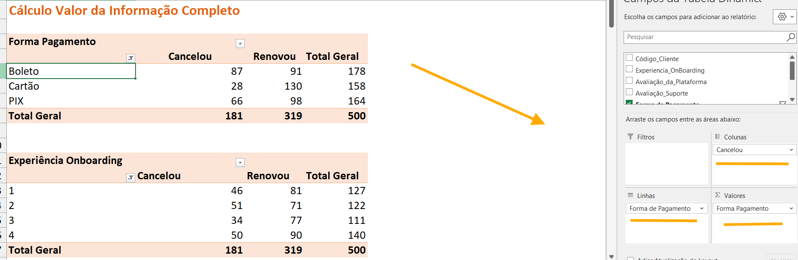
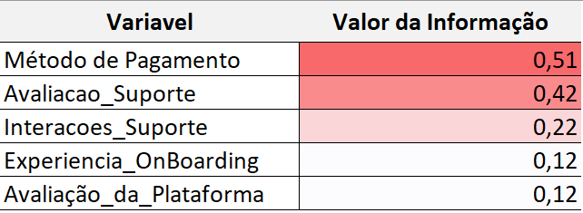
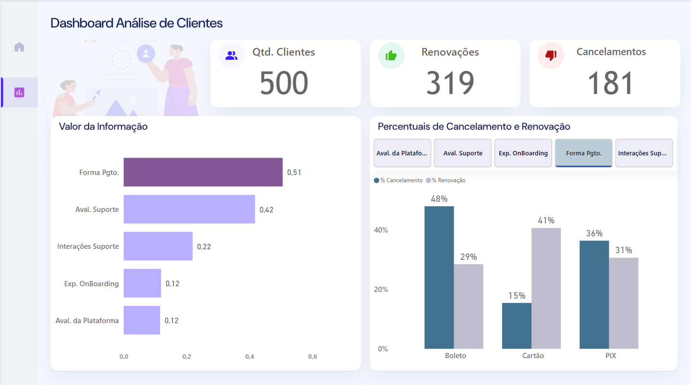

# Análise de Cancelamento de Clientes com VI

Com objetivo em ser simples e direto, esse projeto consiste em uma *análise diagnostica*. 

Iremos abordar o conceito de Cálculo do Valor da Informação (Information Value - IV) para determinar qual - ou quais - variáveis da base de dados impacta diretamente o cancelamento de clientes.

## Objetivos 

- Identificar qual variável aumentou as ocorrências de cancelamento. 

- Criar um visual simples mas com um bom nível de entendimento considerando a real estrutura da base de dados que será analisada.

- Gerar KPIs que nos permita visualizar os principais insights que o contexto de - cancelamentos de clientes - pode gerar.

## Etapas do Projeto

### Cálculo do Valor da Informação (VI)

- Resumir a base (com a ferramenta e tabela dinâmica, dentro do Excel). 

- Usei a tabela dinâmica para agrupar os dados por variável. Como um primeiro exemplo, a forma de pagamento é a primeira variável a ser analisada.
Incluí ela nos campos de linhas e valores. Já no campo de colunas, incluí a coluna de cancelamento.

- Calcular o percentual de cada categoria da variável, dividindo seus valores pelo total geral.
Subtrair os percentuais de cada categoria (usando valor absoluto) entre quem cancelou e quem não cancelou. Repetir isso para todas as variáveis.

### Observação

O cálculo do Valor da Informação foi inicialmente realizado no Excel. Em seguida, integrei a base de dados ao Power BI por meio do Power Query, onde realizei os ajustes e a modelagem necessária para a análise.

### Insight (baseado no cálculo)

A análise usando o Valor da Informação (IV) ajudou a entender quais variáveis mais impactam o cancelamento de clientes.

A variável “Método de Pagamento” teve um IV de 0,51, o que mostra que ela tem muita influência nas decisões de cancelamento. Ou seja, o jeito que o cliente paga pode estar diretamente ligado ao fato dele continuar ou não.

Na sequência, “Avaliação do Suporte” também teve um resultado alto *IV = 0,42*, mostrando que a percepção do cliente sobre o suporte que recebe faz bastante diferença. Já “Interações com o Suporte” ficou com um *IV de 0,22* indicando que a quantidade ou frequência do contato com o suporte também tem um certo peso.

Por fim, “Experiência no Onboarding” e “Avaliação da Plataforma” tiveram IVs de 0,12, o que ainda mostra um impacto moderado, mas que vale a pena observar.

Esse primeiro resultado já dá uma boa noção de quais pontos mais influenciam no cancelamento e ajuda a direcionar o olhar para onde faz mais sentido investigar.

### Estrutura do Dashboard

#### Visão Geral de Cancelamento

**KPIs:**
  - Quantidade de Clientes
  - Renovações
  - Cancelamentos
 
**Gráficos:**
  - Valor da informação (representando a análise feito diante do VI calculado)
  - Percentuais de Cancelamento e Renovação

### Visuais do Dashboard

#### Acesse o Dashboard Interativo

Você pode acessar a versão publicada do dashboard no Power BI clicando no link abaixo:

[Acesse](https://app.powerbi.com/reportEmbed?reportId=53498cf1-c2e5-4546-afd1-78c91ac8d37c&autoAuth=true&ctid=659ce2b8-0714-4198-8c38-dc9b60aabb57)

