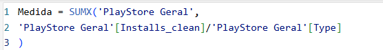
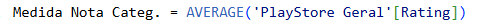
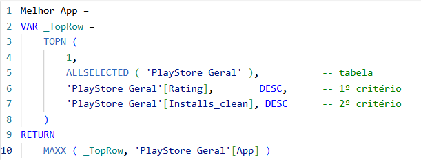
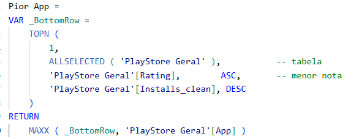
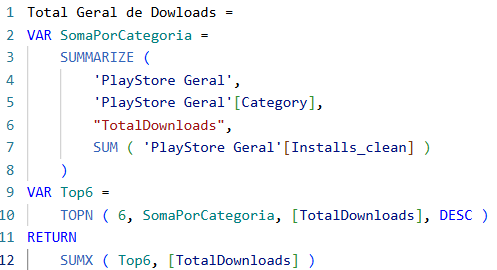
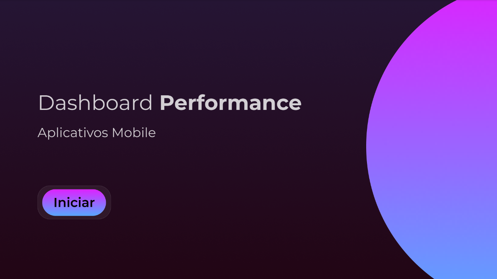
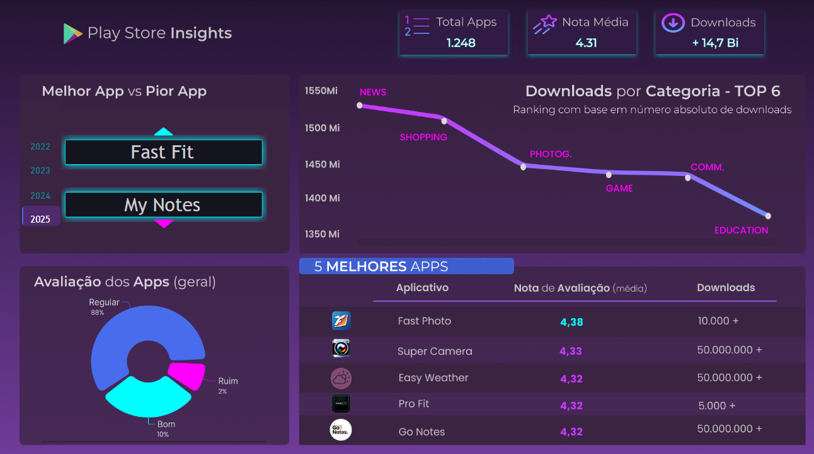

# Play Store Insights (PBI + FIGMA)

Este projeto apresenta um dashboard visual e informativo criado em cima de uma base de dados simulada da Play Store. A proposta central foi explorar os dados de maneira leve, com um grande foco estético e comunicativo — ideal para profissionais de dados que também se preocupam com design e apresentação.

A ideia foi entregar algo que, mesmo com uma base simples, transmitisse cuidado, criatividade e domínio de ferramentas visuais.

## Objetivos

O objetivo central é criar um painel com ênfase visual afim de apresentar insights relevantes sobre os aplicativos da Play Store nos últimos anos.

- Exibir insights simples, diretos e de alto impacto para o público;

- Destacar análises objetivas, voltadas para compreensão do contexto

- Valorizar a experiência visual com interface 100% criada no Figma;

- Utilizar visualizações interativas com Power BI para facilitar a compreensão dos dados.

## Base de Dados Utilizada

A base utilizada contém dados fictícios sobre aplicativos da Play Store, a mesma foi retirada do site Keaggle. A escolha dessa base consiste em 2 ponto principais:

- Ela é boa para mostrar leve domínio em dados digitais e mobile
- Esse tipo de base, nós permite fazer um painel mais estético (sem muitas interações) mas essencial para entender os insights sem muito esforço cognitivo. 

Dentre outras, as principais colunas da base são: 

- Nome do aplicativo
- Categoria
- Quantidade de downloads
- Nota de avaliação

Base utilizada: https://www.kaggle.com/datasets/lava18/google-play-store-apps

> A base passou por uma limpeza, ajustes, criação de colunas e tabela auxiliares para melhor visualização e criação dos indicadores.

## Ferramentas Utilizadas 

- Power BI – para manipulação dos dados, DAX e gráficos.
- Power Query - para limpeza e ajustes.
- *Figma* – para estruturação estética, layout visual e identidade do dashboard, personalização de ícones.

## Etapas do Processo

### Exploração da base de dados 

- Análise inicial da base da Play Store para entender as colunas disponíveis, formatos e padrões.
- Identificação de colunas relevantes para o dashboard (nome do app, categoria, nota, downloads etc).

### Limpeza e preparação dos dados 

- Ajustes manuais e uso do Power Query para breve limpeza.
- Criação de medidas em DAX para cálculos como média de avaliação, top rankings e segmentações.

#### Algumas DAX feitas:

### Definição da proposta visual

- Escolha da paleta de cores, tipografia e estrutura do layout.
- Planejamento do foco visual com base no storytelling dos dados.
- Criação do layout completo no Figma, com todos os elementos visuais do dashboard.
- Estruturação dos quadrantes que fará parte do dashboard.

### Construção no Power BI

- Importação da base e estruturação do modelo de dados.
- Criação dos gráficos e cards com base nas medidas DAX.
- Integração visual com elementos do Figma (ex: botões, ícones e fundo personalizado).

### Ajustes finais e refinamento

- Ajustes estéticos, alinhamento e últimos detalhes para manter a consistência visual e o equilíbrio do layout.
- Validação dos insights apresentados para garantir clareza na leitura.
- Criação de capa para o projeto.

## Principais Análises

- Top 5 aplicativos com melhores avaliações
- Categorias com maior número de downloads
- Distribuição de notas (Bom, Regular, Ruim)
- Comparação visual entre o melhor e o pior app
- Indicadores gerais: total de apps, nota média e total de downloads

## Visuais do Dashboard

#### Acesse o Dashboard Interativo

Você pode acessar a versão publicada do dashboard no Power BI clicando no link abaixo:

[Acesse]https://app.powerbi.com/view?r=eyJrIjoiM2Q5ZTM0YjgtZDViNy00NTQ3LWFkODUtZWE3OThhMjAyOTQ5IiwidCI6IjY1OWNlMmI4LTA3MTQtNDE5OC04YzM4LWRjOWI2MGFhYmI1NyJ9

## Principais Insights Gerados

- A maioria dos aplicativos da Play Store tem nota média entre 4.2 e 4.3, o que mostra uma avaliação geral muito parecida.
- Algumas categorias se destacam pelo alto número de downloads, como jogos e ferramentas de produtividade.
- Mesmo com notas próximas, é possível identificar os apps com melhores e piores avaliações na base.
- A maior parte dos aplicativos analisados foi classificada como “regular” com base na nota.
- O top 5 de aplicativos mais bem avaliados também aparece entre os mais baixados, mostrando consistência entre popularidade e qualidade percebida.

