# Projeto de ETL e Modelagem de Dados com Power BI

Este projeto tem como foco principal a aplicação do processo de ETL (Extração, Transformação e Carregamento) e modelagem de dados utilizando o Power BI.
A partir de uma base de vendas de supermercado, foram aplicadas etapas de limpeza, padronização e transformação de dados usando a linguagem M no Power Query.
Depois disso, foram criadas medidas com DAX para começar a explorar os dados e entender melhor as informações da base — deixando tudo pronto para que, no futuro, sejam construídos dashboards interativos.

Embora seja um projeto simples, ele é bastante útil para o dia a dia de quem trabalha com dados, principalmente para treinar boas práticas de preparação e modelagem.
A mesma base já foi utilizada em um projeto voltado para Análise de Dados com IA, mostrando que, no mundo dos dados, é possível realizar diferentes tipos de análises, 
limpezas e modelagens em bases com a mesma estrutura.

## Objetivos 

 - Consolidar conhecimentos em ETL e modelagem de dados no Power BI. 
 - Praticar técnicas essenciais para o dia a dia de quem trabalha com dados. 
 - Exercitar o uso da linguagem M no Power Query e aplicar medidas DAX iniciais, com foco no preparo da base para futuras visualizações.

## Base de Dados Utilizada

A base utilizada neste projeto foi retirada do Kaggle e contém informações de vendas em supermercados de três cidades diferentes, com colunas como: 
produto, avaliação, método de pagamento, data da venda, entre outras.

Link para a base: [Supermarket Sales Dataset – Kaggle](https://www.kaggle.com/datasets/faresashraf1001/supermarket-sales)

## Ferramentas Utilizadas

 - Power BI (Power Query e DAX)

## Etapas do Processo

### ETL (Power Query)

1. **Remoção de linhas em branco e duplicatas**
   
   Para garantir que a base de dados não tenha registros vazios, linhas em branco e valores duplicados que possam prejudicar a análise. 
 
   

2. **Renomeação das colunas (todas de uma vez) usando linguagem M**
  
   Para deixar os nomes das colunas mais claros e padronizados.  

   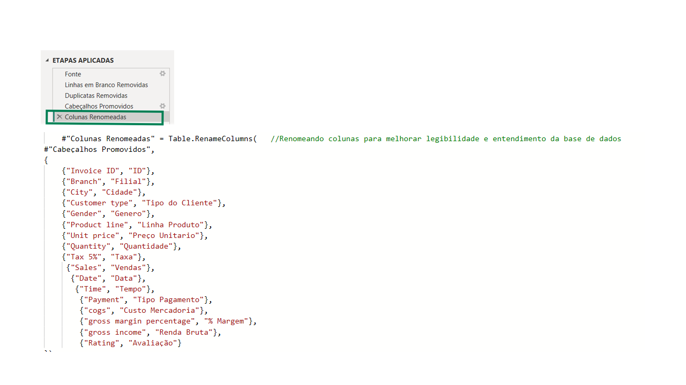

3. **Substituição dos valores da coluna `Gênero`** 

    Para deixar os valores em português: “Female” → “Feminino” e “Male” → “Masculino”. 
 
   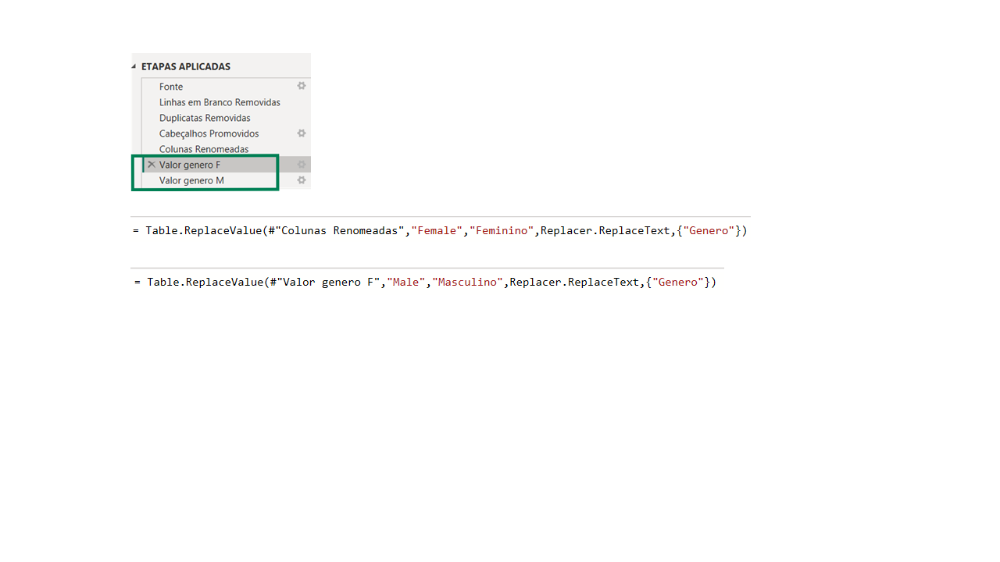

4. **Alteração dos tipos de dados das colunas (linguagem M)**  

   Para garantir que cada coluna tenha o tipo correto, facilitando cálculos e filtros (exemplo: datas, números, texto).
   Incluindo formatação da coluna de datas para padrão americano MM/DD/YYYY.  

   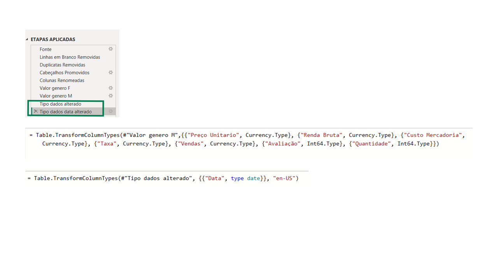

5. **Criação de coluna condicional para categorizar avaliações** 
 
   Com base na coluna "Avaliação", já presente na base, foi criada a coluna “Categoria Avaliação”, permitindo agrupar os dados em faixas de notas para facilitar as análises. 
   As categorias criadas foram:

   - Péssimo  
   - Ruim  
   - Regular  
   - Bom  
   - Excelente 
 
   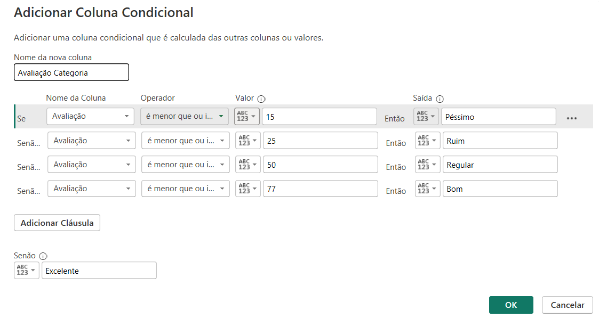

 - Por fim, duas colunas foram excluídas do conjunto de dados: Tempo e % de Margem. A decisão foi tomada por não contribuírem com os objetivos do projeto neste momento.

 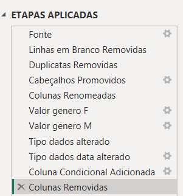

#### Observações

Como vimos no print final, a parte de "Etapas Aplicadas" ficou bem resumida. Esse conceito é bem importante dentro do ambiente do Power Query, pois contribui para que o arquivo
fique leve, mesmo com as edições implementadas. Ressalto que, a base trabalhada nesse exemplo é enxuta, mas esse conceito além de ser uma boa prática no dia a dia, mostra  
eficiência destacando também o papel importante que a Linguagem M tem dentro do Power Query.

### Criação de Tabela Calendário

Uma boa prática em projetos de análise de dados é trabalhar com uma **tabela calendário** separada e bem estruturada. 
Isso permite:

- Criar relações mais consistentes com colunas de data.
- Utilizar funções de tempo no DAX, como `TOTALYTD`, `DATEADD`, entre outras.
- Ter controle total sobre o formato e hierarquia das datas.

No projeto, a Tabela Calendário foi criada com DAX, a partir da menor e maior data existente na base principal.

As colunas criadas incluem:

- Ano
- Mês (nome e número)
- Início do mês
- Trimestre
- Dia da semana
- Nome do dia
- É Final de Semana?

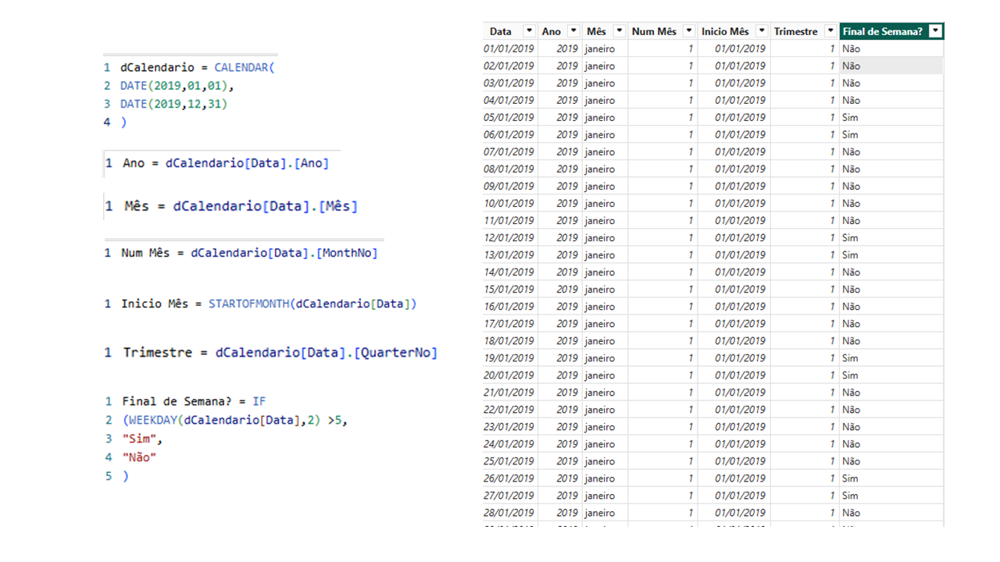

### Relação da Tabela Calendário com a Tabela Principal
> Para possibilitar análises temporais eficientes, a tabela calendário foi relacionada à tabela principal de vendas por meio da coluna de data.  
> Essa relação do tipo “um-para-muitos” (um na tabela calendário para muitos na tabela de vendas) permite o uso correto das funções DAX de inteligência de tempo, como `DATESYTD`, 
> além de garantir filtros e comparações temporais precisas.

### Análises com DAX (modelagem e métricas)

Abaixo segue algumas perguntas que teve como objetivo coletar insights da base analisada: 
  
1. **Qual é a linha de produto com mais vendas?**

Para chegar nesse resultado, foram criadas **três medidas DAX** que se complementam:

- A quantidade total de vendas.
- O ranking de cada linha de produto com base nas vendas.
- E uma medida final que retorna a categoria que ficou em primeiro lugar.

Apesar de simples, esse conjunto de fórmulas já mostra como é possível usar DAX para criar **lógicas encadeadas** e estruturadas em etapas — facilitando tanto a organização quanto a 
reutilização dessas medidas ao longo do projeto.

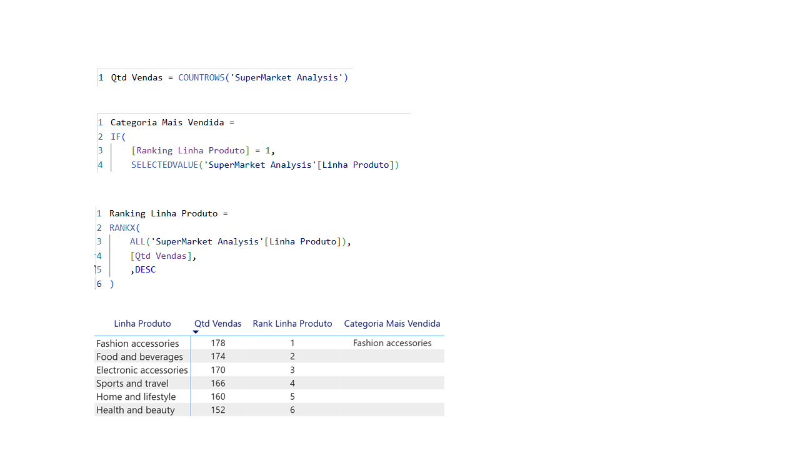

2. **Qual forma de pagamento é mais utilizada?**

Medida criada para retornar a forma de pagamento com o maior número de vendas. 

- Ela simula um comportamento parecido com `SELECT TOP 1` no SQL, usando as funções `CALCULATE`, `TOPN` e `SELECTEDVALUE`

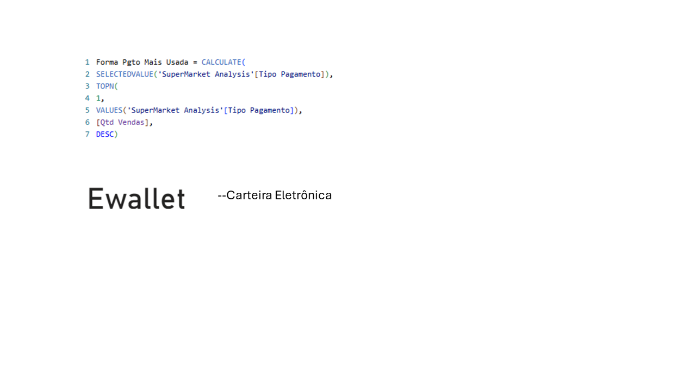

3. **Qual é o faturamento acumulado da linha de produto *Sports & Travel*?**

Medida criada para retornar o faturamento acumulado da categoria *Sports and travel* ao longo do ano, utilizando inteligência de tempo.

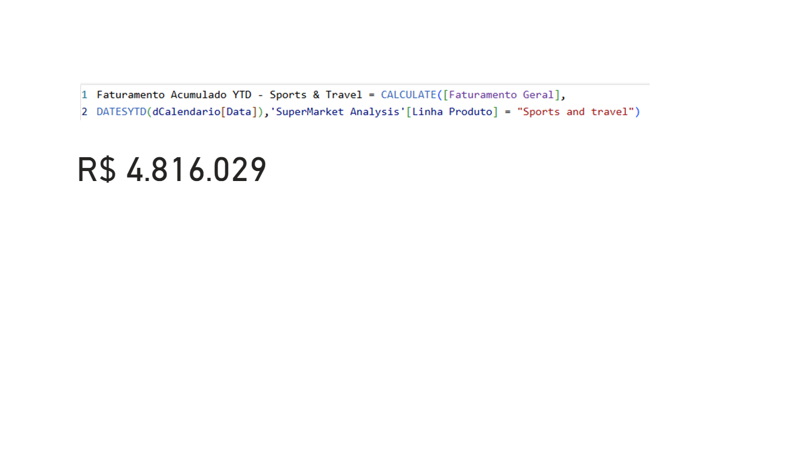

4. **Qual a representatividade (em %) da linha *Sports & Travel* no faturamento total?** 

Medida criada para retornar o percentual que a linha *Sports and travel* representa no faturamento total do ano.

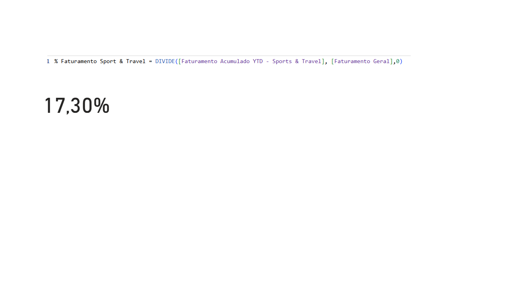

#### Observações

O uso da função \`DIVIDE\` garante que não haja erro em casos de divisão por zero.

5. **Qual é o ticket médio?**  

Medida criada para retornar o valor médio de cada venda registrada na base.

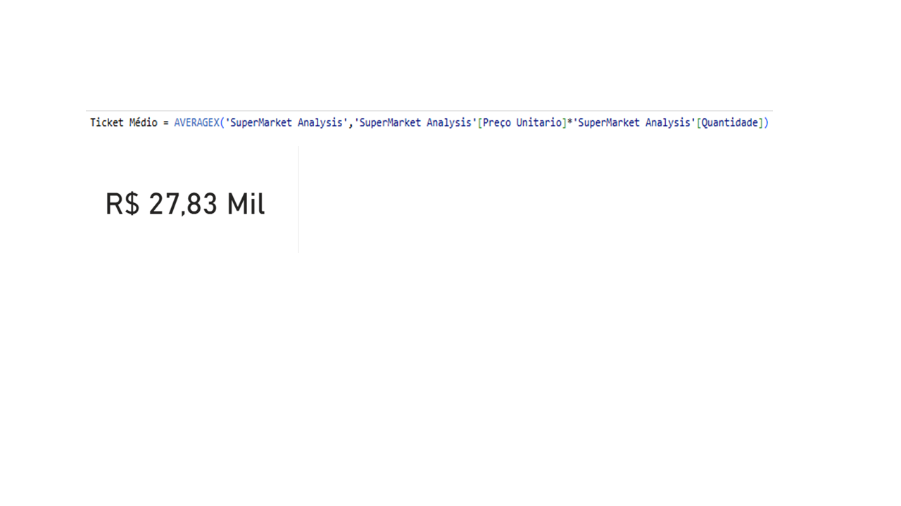

#### Observações

O ticket médio ficou elevado porque os dados estão agrupados por categoria de produto, com preços unitários altos que representam itens de maior valor agregado.

## Considerações Finais

Este projeto teve como objetivo aplicar boas práticas de ETL e modelagem de dados com Power BI, construindo uma base limpa, organizada e pronta para análise. 
Apesar de ser um projeto simples, os conceitos aplicados aqui são fundamentais e refletem situações reais de trabalho com dados.

A partir da estrutura criada, é possível seguir com análises mais avançadas, visualizações e outras integrações, conforme a necessidade do negócio ou escopo do projeto.

# Observação sobre Modelagem Dimensional (Fato e Dimensão)

A tabela principal utilizada neste projeto é uma única tabela “tabelão”, que reúne informações tanto de fatos (transações de vendas) quanto de dimensões atributos descritivos
como (gênero, linha de produto, método de pagamento, etc).

Em projetos mais complexos e escaláveis, é prática comum dividir os dados em tabelas fato e dimensão, criando relacionamentos baseados em chaves únicas (como SKU, códigos de cliente, etc).  
Essa separação melhora a organização, desempenho das consultas e facilita manutenções futuras.

Apesar de não ter aplicado essa divisão neste projeto, reconheço a importância do modelo dimensional e o valor que ele traz para análises mais robustas.

