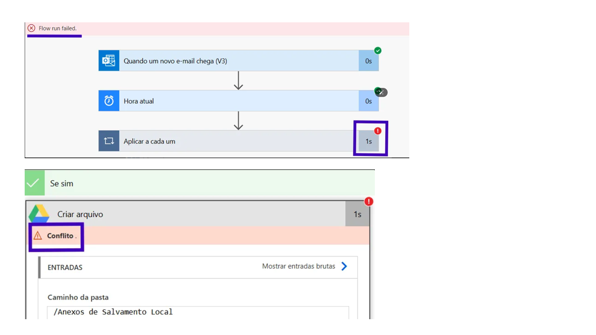
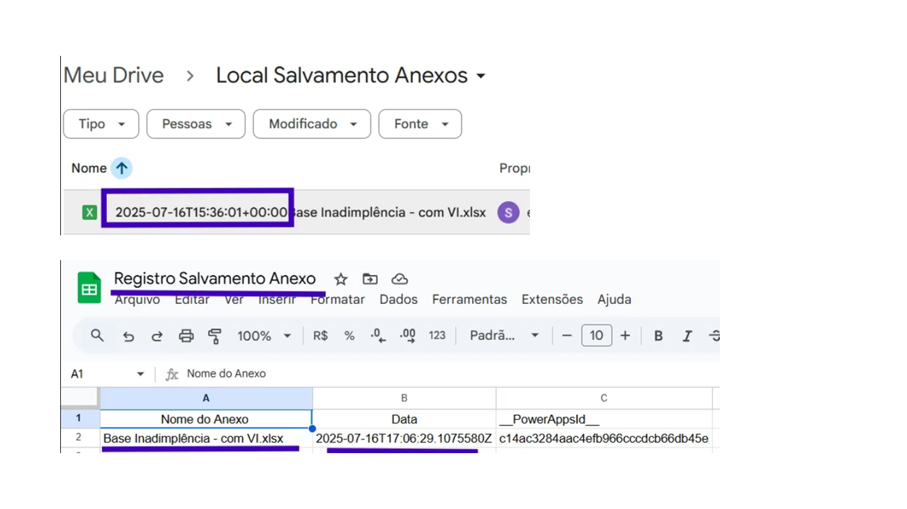

# Fluxo Automático: Do E-mail ao Drive com Notificação no Celular e Registro em Planilha

## Cenário

Imagina a seguinte situação:
  
A Ana trabalha no time financeiro de uma empresa de médio porte. Todos os dias ela recebe dezenas de arquivos que estão no formato .XLSX  que precisam ser baixados manualmente, 
salvos em pastas específicas e registrados em uma planilha de controle geral. 

Com o acúmulo de tarefas, vira e mexe um arquivo fica esquecido na caixa de entrada, ou acaba sendo salvo no lugar errado — o que gera retrabalho e atrasos no fechamento do financeiro.

Pensando nesse tipo de rotina, criei esse fluxo no **Power Automate**, com o objetivo de **automatizar o processo de salvamento de anexos (.XLSX)  e organizar os recebimentos de forma prática e funcional**.

Esse tipo de automação é super útil pra áreas como **financeiro, logística, jurídico, RH ...**, dentre outra que lidam com documentos frequentes por e-mail e precisam 
garantir organização, agilidade e controle.

> Mesmo sendo um fluxo simples, esse tipo de automação faz toda a diferença no dia a dia.  
> O Power Automate é uma ferramenta da Microsoft que permite criar **fluxos de automação** entre diferentes aplicativos e serviços — como e-mail, planilhas, notificações, 
armazenamento em nuvem e muito mais.  
> Mesmo com pouca ou nenhuma programação, é possível automatizar tarefas do dia a dia e integrar ferramentas de forma prática e visual.

## Objetivo

O objetivo deste projeto foi **automatizar o recebimento e armazenamento de anexos de e-mails**, usando o **Power Automate**. A ideia foi criar um fluxo simples que:

- Detecta quando um e-mail chega com anexo;
- Salva automaticamente o anexo em uma pasta específica do **Google Drive**;
- Envia uma **notificação no celular** para informar sobre o novo arquivo;
- Registra os detalhes do e-mail e do anexo em uma **planilha de controle**.

Com esse fluxo, é possível ganhar tempo, evitar erros manuais e manter tudo documentado automaticamente — sem depender de ações repetitivas do usuário.

## Ferramentas Utilizadas  
- Power Automate  
- Outlook (conector de e-mail)  
- Google Drive  
- Google Planilha
- Aplicativo Power Automate (para notificação no celular)

## Planejamento do Fluxo

Antes da criação de qualquer fluxo, temos que planejar as etapas. Nesse projeto, será criado 7 fluxos, visualize-os no print abaixo:

## Etapas da Automação

1. Definição de Gatilho e inclusão de Data: 

O gatilho definido foi de E-mail com a ação de **Quando um novo e-mail chega**

Dentro dessa etapa, também foi definido o parâmetro que comunica ao gatilho que o e-mail terá que incluir anexos, pois o fluxo irá atuar nesse tipo.

 
- Pegamos a "data de hoje" para que o fluxo retorne a data atual.

2. Verificar Terminação do Arquivo:

Aqui entra o nosso teste lógico onde vamos escolher uma ação atribuindo à etapa anterior.

Na condição, o e-mail com o anexo só irá pra etapa de ação se responder ao seguintes parâmetros: 
- é um anexo? 
- o anexo termina no formato .xlsx? 

**se sim** o fluxo discorre, se não, tudo é desconsiderado.

Uma observação é que como esse fluxo é em loop (um fluxo repetitivo), todo o contexto será "aplicado á cada um"
a cada e-mail que tiver um ou - mais de um anexo - (estando dentro das condições), o Power Automate vai aplicar o fluxo. 

3. Salvar Arquivo no Google Drive: 

Criamos uma pasta no google drive, e na etapa **se sim** incluiremos o caminho da pasta e alguns parâmetros para o salvamento na pasta escolhida.

4. Registrar no Google Planilhas: 

Ainda na etapa de **se sim** incluímos o fluxo de registrar os anexos salvos (com data) em uma base do Google Planilhas.

Incluiremos o caminho da pasta e alguns parâmetros para o salvamento de registros na planilhas escolhida e também atribuímos a data (escolhida na etapa 1). 

> ## Teste 

> No Power Automate é super importante ir testando o fluxo, diante disso, ao testarmos o que criamos até agora deparemos com um erro de **conflito**

> 

> Mas porque isso aconteceu? 

> O fluxo está tentando criar uma arquivo dentro de uma pasta mas, existe um arquivo dentro da pasta com o mesmo nome. 

> A solução é adicionar a **data atual** antes do nome do anexo, desse modo, (mesmo contendo o mesmo nome) os anexos serão diferenciados com a data, hora, e segundo de envio. 

> 

> 

5. Modicar Hora, Data e Fuso Horário

Parte importante pois, observando as duas ultimas imagens da etapa de "teste" vimos que o horário que o arquivo é registrado na base está no fuso 00.

O Power Automate deixa por padrão, mas pensando no nosso dia a dia de trabalho, esse fuso não é tão interessante assim, vamos converter. 

6. Enviar Notificação no Celular

Pensando em deixar nossa automação ainda mais personalizada, enviaremos uma notificação para o celular (dentro do app do Power Automate) da conta cadastrada. 

Esse tipo de alerta é útil para acompanhamento do processo em tempo real

## Resultado Final da Automação 

## Considerações Finais

Mesmo sendo um fluxo simples, esse projeto mostra como pequenas automações podem gerar grandes impactos no dia a dia de uma equipe. A rotina da Ana — que representa muitos profissionais em áreas operacionais — se torna mais leve, confiável e organizada com um processo automatizado e personalizado.

Além disso, reforça o quanto ferramentas como o Power Automate são acessíveis e poderosas, mesmo para quem está no início da jornada com automações.

# Possíveis Melhorias

- Integrar com o Power BI para acompanhar os registros com gráficos e métricas
- Enviar automaticamente um resumo semanal com o total de anexos recebidos
- Adicionar filtros avançados no e-mail (ex: processar apenas se for da área X)
- Organizar os anexos em pastas diferentes, conforme o tipo de documento

> Essas melhorias futuras podem tornar o fluxo ainda mais robusto e alinhado com diferentes necessidades de negócio.

