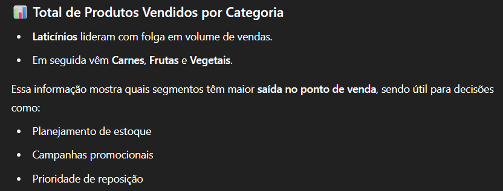
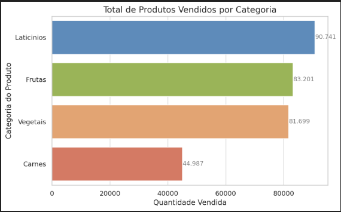
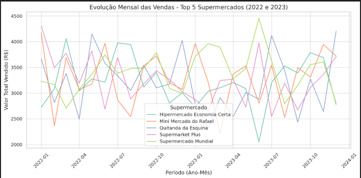
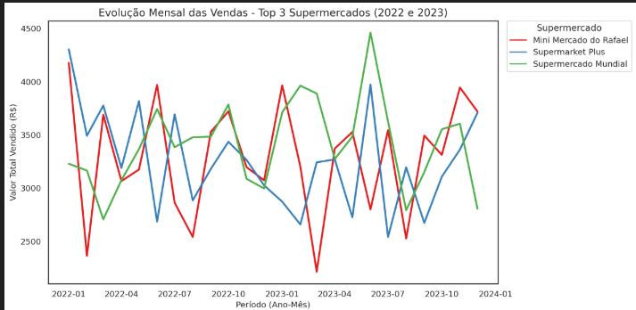
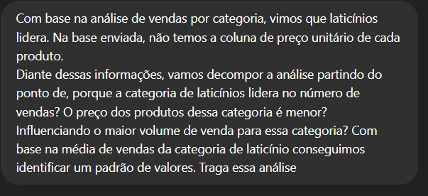
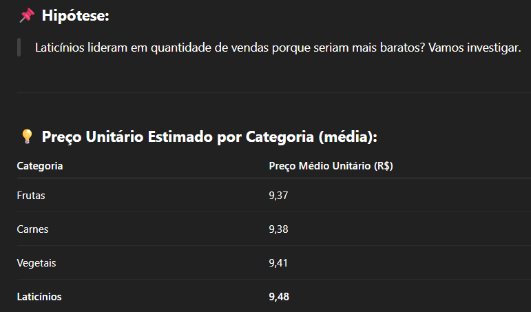
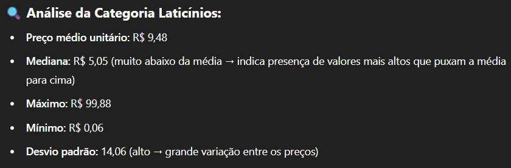
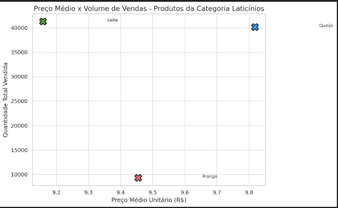

# Análise Descritiva de Vendas de Supermercado no Brasil

Este é um projeto introdutório de análise de dados com foco em uma **análise descritiva exploratória** de uma base de vendas de supermercado. 

Ideal para abrir o portfólio e demonstrar habilidades iniciais em exploração de dados.

## Objetivos

- Mostrar que, com prompts bem elaborados — mas ainda assim claros e sucintos — a Inteligência Artificial é capaz de entregar resultados funcionais e aplicáveis no contexto do dia a dia da Análise de Dados.

- Entendimento geral da base.

- Distribuição de valores de venda e quantidade.

- Preparação para projetos mais analíticos que envolvam conceitos como sazonalidade e decomposição de séries temporais.

### Roteiro da Análise

A ferramenta de Inteligência Artificial usada foi o chat GPT em sua versão gratuita, permitindo conduzir a análise nas etapas a seguir: 

1. Análise por Categoria

2. Análise Temporal

3. Foco nas Categorias com maior volume

4. Iterações com a IA (ajustes e melhorias no Storytelling dos gráficos)

## Vendas por Categoria de Produto

### Prompt Utilizado

### Resposta da IA

### Gráfico Gerado

## Evolução Mensal das Vendas e Ranking por Período

### Prompt Utilizado

### Resposta da IA

### Gráfico Gerado

### Correção e Melhorias no Gráfico Evolução Mensal

## Decomposição por Categoria com Maior Número de Vendas

### Prompt Utilizado

### Resposta da IA

### Gráfico Gerado

## Considerações Finais 

A proposta também incluiu o uso exclusivo de IA gratuita, destacando que mesmo com recursos limitados é possível desenvolver análises com qualidade, desde que guiadas por raciocínio analítico e perguntas bem formuladas.

A análise descritiva realizada com base em vendas de supermercado permitiu:
 - Uma visão geral sobre a distribuição de vendas por categoria.
 - A identificação de padrões mensais de faturamento.
 - E a decomposição de métricas nas categorias mais relevantes.

Mais do que apenas gerar gráficos, o projeto reforça a importância do pensamento analítico e da capacidade de traduzir dados em informações úteis para o negócio, mesmo em um cenário ainda exploratório.

