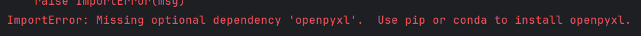
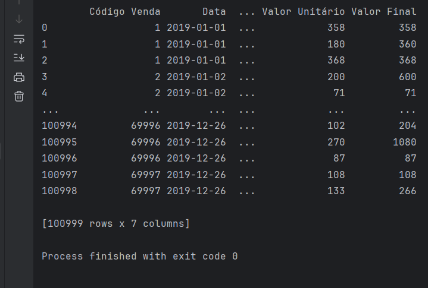
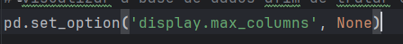
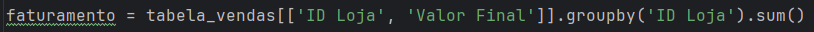
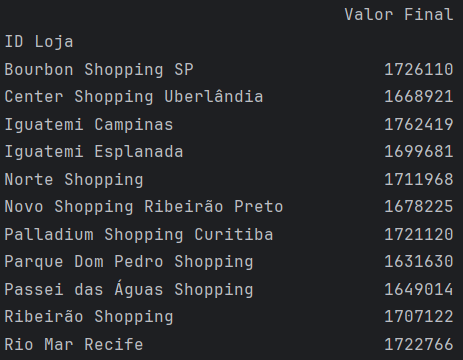
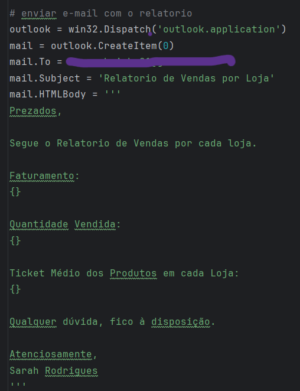
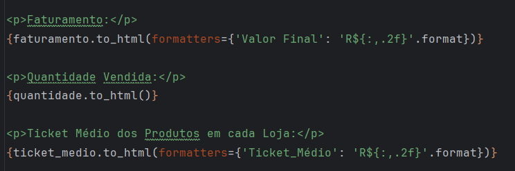
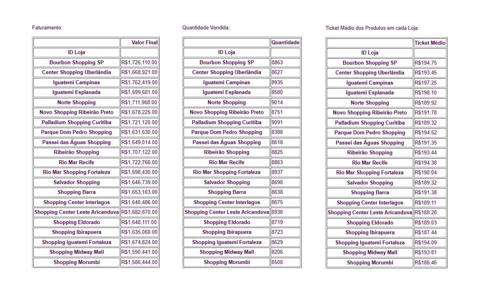

# Analise de Dados e Automação com Python

Este projeto tem como finalidade analisar uma base de dados de vendas, realizando o cálculo de indicadores chave (KPIs) essenciais para a compreensão do desempenho comercial das lojas. 
A partir da base de dados que contem mais de 100 mil linhas, serão extraídos dados sobre as movimentações das lojas, que permitirão avaliar o faturamento, a quantidade de produtos vendidos e o ticket médio por loja. 

Além disso, ao final do processo, será gerado e enviado automaticamente um relatório por e-mail contendo essas análises, facilitando a comunicação dos resultados no contexto do dia a dia. 

## Objetivo

O principal objetivo deste projeto é automatizar a análise de vendas por loja, proporcionando insights rápidos e precisos por meio de indicadores como:

Além disso, o projeto busca **simplificar o fluxo interno**, automatizando etapas que normalmente seriam feitas manualmente. 
Com o uso de **Python**, é possível integrar a leitura da base de dados, o cálculo dos indicadores e o envio do relatório por e-mail de forma prática e eficiente.

## Base de Dados Utilizada

Base fictícia com +100 mil linhas simulando vendas.

Colunas principais:
- Data da venda
- Loja
- Produto
- Valor
- Categoria

Permite análises reais (faturamento, ticket médio etc.) e testes de automação com Python.

## KPIs Gerados

Durante a análise, foram criados os seguintes indicadores:

- Faturamento total por loja;
- Quantidade total de produtos vendidos por loja;
- Ticket médio por produto em cada loja.

## Ferramentas Utilizadas

- **PyCharm** — ambiente de desenvolvimento utilizado para escrever e executar o código.
- **Excel** — base de dados em formato .xlsx.
- **Outlook** — usado para automatizar o envio do e-mail via integração com Python (disparar gatilho). 
- **Gmail** — destinatário configurado para receber o relatório com as análises.

## Bibliotecas Utilizadas

- pandas — para manipulação e análise dos dados.
- win32com.client — para automatizar o envio de e-mails pelo Outlook.

# Lógica da Programação

O projeto foi estruturado de forma simples e funcional, com foco em três pilares principais: **leitura da base de dados**, **análise dos dados** e **automação do envio do relatório por e-mail**. 

Confira a baixo o escopo do projeto que foi seguido no código: 

1. **Importação de bibliotecas** necessárias para análise de dados e automação.
2. **Carregamento da base de dados** em Excel utilizando o pandas.
3. **Visualização e tratamento dos dados**, garantindo que as colunas necessárias estejam disponíveis.
4. **Cálculo dos KPIs principais**:
   - Faturamento por loja
   - Quantidade vendida por loja
   - Ticket médio por loja
5. **Geração do corpo do e-mail em HTML**, incorporando as análises em formato de tabela.
6. **Envio automático do relatório via Outlook**, com gatilho disparado diretamente do script.

## Etapas do Projeto

1. Depois de importarmos as bibliotecas, chegamos na parte de carregar a base de dados utilizando pandas. Pelo fato da BD ser no formato .XLSX, é necessário importarmos também 
o pacote OPENPYXL para de fato, conseguirmos abri o arquivo .XLSX 

2. Aqui vamos fazer um leve ajuste na visualização dos dados (ainda dentro do PyCharm). Esse etapa é importante para saber se o Pandas está lendo a base de dados de forma coerente.
Uma etapa de boa prática!

3. Para iniciarmos de fato a análise dos dados a fim de extrairmos os 3 indicadores proposto no começo do projeto, vamos adotar a lógica de filtragem das colunas e agrupamento com soma. 

a partir daqui, iremos criar os outros indicadores. Código completo disponível no arquivo .main

4. Nessa etapa, criamos um e-mail automático com Python, integrando com o Outlook (que atua como nosso gatilho) e, por fim, enviando para o Gmail.

### Observações

Importante pontuar que essa parte do código foi adaptada de uma resposta no fórum Stack Overflow. Fiz algumas modificações e entendi a lógica por trás, que consiste no seguinte:

> outlook = win32.Dispatch('outlook.application')
> criou uma variável chamada outlook (nessa parte ele está conectando com o outlook do meu computador)

> mail = outlook.CreateItem(0)
> aqui ele criou um e-mail

> mail.To =
> pra quem vou enviar

> mail.Subject =
> qual o assunto do e-mail

> mail.HTMLBody =
> qual o corpo do e-mail (o corpo do e-mail é um HTML)

> e por fim, o envio: 
> mail.Send()

5. Como o corpo do e-mail é em um formato HTML, qualquer tipo de formatação terá que ser compatível a esse formato.
Fizemos os seguintes ajustes: 

- Inclusão de Tag (para delimitar começo e fim de paragrafo).
- Conversão das variáveis criadas em tabelas.
- Inclusão das variáveis dentro do corpo do e-mail por meio do f-string. 
- Editar o nome das colunas.
- Formatar os valores (de número) do relatório que será enviado por e-mail. 

### Visualização do Relatório Gerado

Resultado do envio e do recebimento dos e-mail:

Resultado das tabelas criadas:

## Código Completo 

O código completo do projeto está disponível no arquivo [main.py](./main.py)

## Considerações Finais 

Este projeto mostra, de forma prática, como podemos juntar análise de dados com automação no Python para transformar uma base bruta em um relatório claro, útil e enviado 
automaticamente por e-mail.

Além de organizar as informações de forma mais acessível, ele reforça como a automação pode facilitar o dia a dia, poupando tempo, simplificando fluxos e evitando retrabalho.

É um tipo de solução simples, mas poderosa, que pode ser adaptada para vários contextos onde relatórios frequentes são necessários, ajudando na tomada de decisões com mais agilidade.

